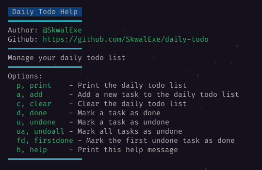

# Daily todo
Manage your daily todo list.
# Installation
clone this repo
```bash
git clone https://github.com/SkwalExe/daily-todo.git
```
run make
```bash
# 📂 daily-todo
make
```
# Usage

# Uninstall
```bash
# 📂 daily-todo
make uninstall
```

# final
If you have any probleme, don't hesitate to open an issue
# contributing
Pull requests are welcome. For major changes, please open an issue first to discuss what you would like to change.