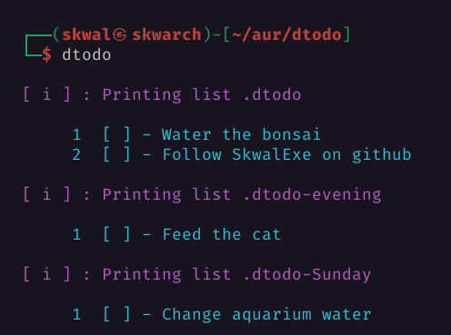
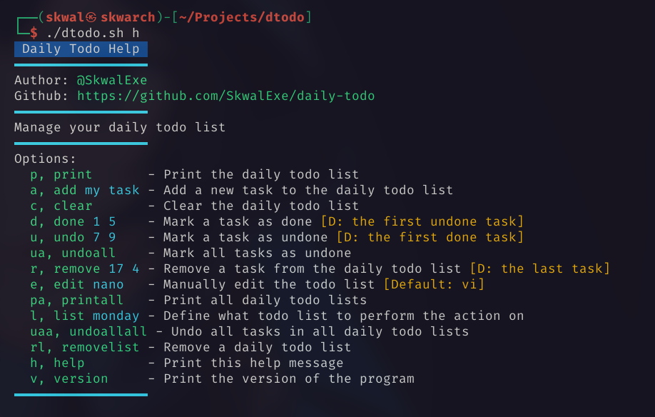

# Daily todo



📜 Manage the tasks you want to do every day easily

# Installation

## Arch

dtodo is in the AUR :)

```
yay -S dtodo
```

## Other distros

clone this repo

```bash
git clone https://github.com/SkwalExe/dtodo.git
```

run make

```bash
# 📂 dtodo
make
```

# Usage



# Uninstall

## Arch

```bash
yay -R dtodo
```

## Other distros

```bash
# 📂 dtodo
make uninstall
```

# Skwaltributors

<a href="https://github.com/SkwalExe/dtodo/graphs/contributors">
  
</a>

# final

If you have any problem, don't hesitate to open an issue

# contributing

Pull requests are welcome. For major changes, please open an issue first to discuss what you would like to change.

<a href="https://github.com/SkwalExe#ukraine"></a>